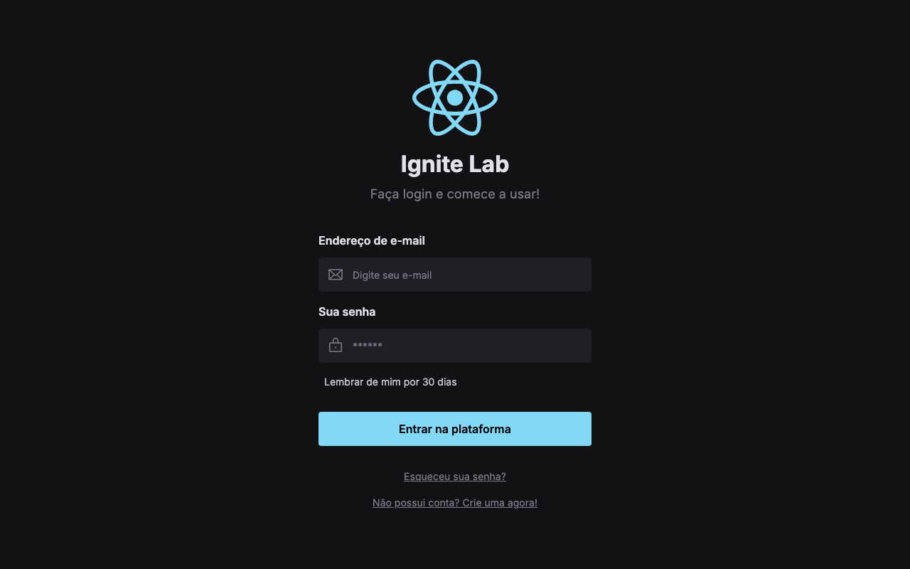

# Ignite Lab Design System

A sign-in screen built with React and Tailwind CSS during a live Rocketseat event, practicing design system fundamentals with Storybook and Radix UI. Built in October 2022.

🔗 [Live demo](https://ignite-lab-design-system-eosin.vercel.app)

## Tech stack

- React, TypeScript, Vite
- Tailwind CSS, Radix UI
- Storybook
- Axios

## How to run

1. Clone this repository.
2. Install dependencies with `npm install`.
3. Run `npm run dev` and open the printed local URL.
